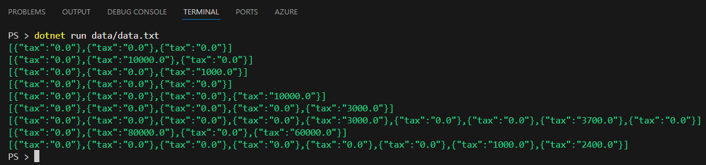
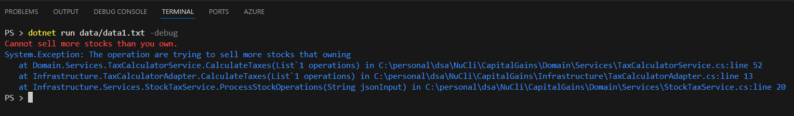
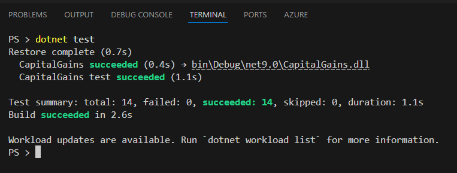
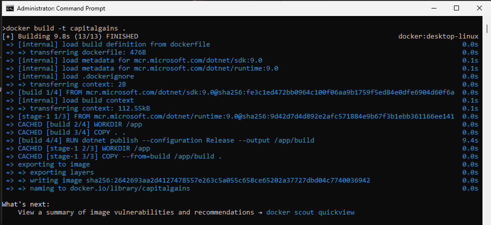
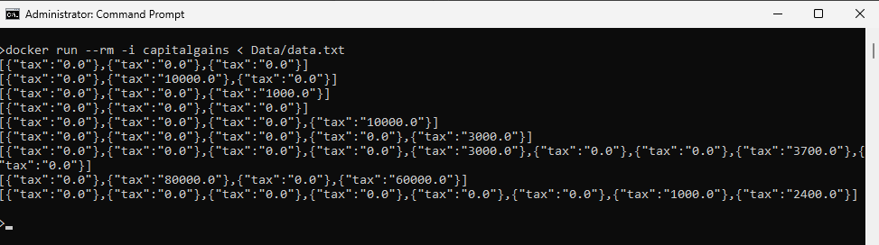
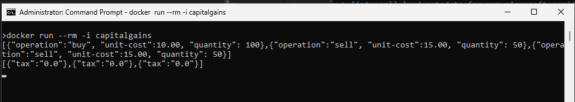

# Stock Trading Tax Calculator

## 🚀 Overview
This project is a **Stock Trading Tax Calculator**, built with **Clean Architecture**, ensuring maintainability, scalability and using clean code principles.

## 📌 Architectural Decisions
The project follows **Clean Architecture**, which separates business logic from infrastructure concerns and frameworks. This ensures:
- **High maintainability** – Each layer is independent and testable.
- **Better scalability** – Changes in infrastructure do not affect business rules.
- **Improved testability** – Business logic is isolated from external dependencies.

📖 Learn more about **Clean Architecture** [here](https://www.geeksforgeeks.org/complete-guide-to-clean-architecture/).

### 🛠 Layers Used
1. **Domain Layer** – Contains **entities** and business rules.
2. **Application Layer** – Houses **use cases** and application logic.
3. **Infrastructure Layer** – Handles **Services, helpers, adapters**.
4. **Presentation Layer** – CLI-based application handling user input, folder **ConsoleApp**.

## 📚 Frameworks & Libraries Used
This project is built using:
- **.NET Core 9** – A modern, cross-platform framework for efficient development.
- **MSTest** – The official testing framework for robust unit testing.
- **System.Text.Json** – Provides efficient JSON serialization and deserialization, *Microsoft* recommends this library instead of Newtonsoft.

## 🖥️ How to Compile & Run
Follow these steps to **compile and execute the program**:

### 🔹 Compilation
Run the following command in the project root *CAPITALGAINS*:

```bash
dotnet build
```


### 🔹 Running the Application
The project supports two **modes of execution**:

#### ✅ Mode 1: Line-by-Line Input
In this mode, you **manually enter stock operations** one at a time:

```bash
dotnet run
```

Then, start typing your operations (press `Enter` after each one):
```json
{"operation":"buy", "unit-cost":10.00, "quantity":10000} {"operation":"sell", "unit-cost":20.00, "quantity":5000}
```


Press `Ctrl + C` or leave an empty line to **exit**.

#### ✅ Mode 2: File Input Mode
If you have **a file with multiple stock operations**, run:
```bash
dotnet run -- path/to/your/file.json
```
Example:
```bash
dotnet run Data/data.txt
```
After running data, that contains all examples from requirement, should be this:


The file must contain **a valid JSON array** of stock operations:
```json
[ {"operation":"buy", "unit-cost":10.00, "quantity":10000}, {"operation":"sell", "unit-cost":20.00, "quantity":5000} ]
```

## 🧑‍💻Making portable version for Windows x64
```bash
dotnet publish --configuration Release --self-contained true /p:PublishSingleFile=true --runtime win-x64
```

## 🪲 Enabling debugging
The project contains a file with an invalid scenario on data1.txt, if you enable debugging, you'll the errors:
```bash
dotnet run Data/data1.txt -debug
```
After running on debug, it will show blue font like this:


## 🧪 Running the Tests
To ensure correctness, run unit tests using MSTest:

```bash
dotnet test
```

The tests will validate:
- **9 Scenarios from the requirement document sent by email**
- **Tax calculations**
- **Invalid operations handling**
- **JSON parsing correctness**

You will seee that all test passed like this:



## ℹ️ Additional Notes
- The tax calculation uses **progressive taxation**, adjusting for previously paid taxes and losses.
- Only `"buy"` and `"sell"` operations are supported, other values are **ignored**.
- Ensure **input JSON is correctly formatted**, otherwise, errors may occur.

---

ℹ️ If you want to see on a pretty format this documentation, press: 
```bash
ctrl+p then Markdown:Open Preview
```

🚀 The folder already contains the .exe in case you don't have dotnet core 9 installed, it is built on Release mode for improving performance.

Example:
```bash
capitalgains.exe Data/data.txt
```

## ⭐ Docker friendly
This application runs on docker, as is on netcore, it will work on Mac, Linux and Windows, steps for running on docker:

Open terminal with permissions (as Administrator on Windows)

```bash
docker build -t capitalgains .
```


Run docker app using file
```bash
docker run --rm -i capitalgains < Data/data.txt
```


Run docker app using manual feature, it will allow to paste every line and process data.
```bash
docker run --rm -i capitalgains
```
